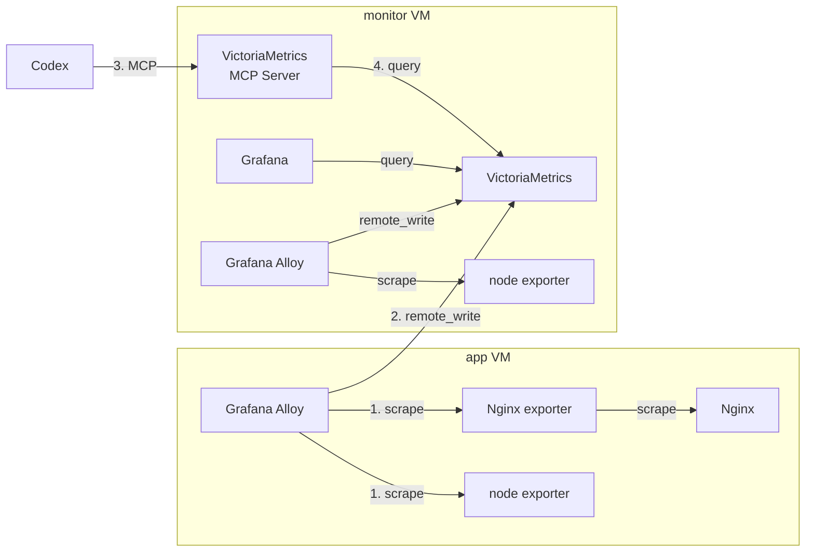

# CodexからVictoriaMetricsのメトリクスを取得してみた

ブログ「CodexからVictoriaMetricsのメトリクスを取得してみた」で使用するサンプルです。TerraformでGoogle Cloud上に検証用VMを作成し、AnsibleでVictoriaMetrics、VictoriaMetrics MCP Server、Grafana、Grafana Alloyなどを構築します。最後にCodexをMCP Serverへ接続し、自然言語でVictoriaMetricsのメトリクスを参照します。

## 構成



Terraformは同一VPC内に次の2台を作成します。OSはいずれもRocky Linux 10です。

| VM | Ansibleが導入する主なサービス |
|---|---|
| `app` | Nginx、Nginx exporter、node exporter、Grafana Alloy |
| `monitor` | VictoriaMetrics、VictoriaMetrics MCP Server、Grafana、node exporter、Grafana Alloy |

主な待受ポートは次のとおりです。Terraformの`allowed_ssh_ranges`は、外部からのTCP `22`、`3000`、`8081`、`8428`へのアクセス元をまとめて制限します。NginxのTCP `80`は現在のTerraformでは外部公開されません。

| ポート | 用途 |
|---:|---|
| `22` | SSH / Ansible |
| `3000` | Grafana |
| `8081` | VictoriaMetrics MCP Server |
| `8428` | VictoriaMetrics |

## ディレクトリ構成

```text
.
├── terraform/  # GCPのVPC、ファイアウォール、VMなど
└── ansible/    # ミドルウェアの導入と動作確認
```

本READMEの手順は、現在の`terraform/`および`ansible/`配下のコードに合わせています。

## 前提条件

- 課金が有効なGoogle Cloudプロジェクト
- Google Cloud CLI（Application Default Credentialsを使用できること）
- Terraform 1.5以降
- Ansible Core 2.15以降
- Codex CLI
- 作成したVMへSSH接続でき、`sudo`を実行できるユーザー
- 接続元のグローバルIPv4アドレス

各ツールのバージョンを確認します。

```bash
gcloud --version
terraform version
ansible --version
codex --version
```

Google Cloudへログインし、対象プロジェクトをApplication Default Credentialsへ設定します。

```bash
gcloud auth application-default login
gcloud auth application-default set-quota-project YOUR_PROJECT_ID
```

## 1. Terraformでインフラを作成する

設定例をコピーします。

```bash
cd terraform
cp terraform.tfvars.example terraform.tfvars
```

`terraform.tfvars`を編集します。`YOUR_GLOBAL_IP`には、AnsibleとCodexを実行する端末のグローバルIPv4アドレスを指定してください。

```hcl
project_id = "YOUR_PROJECT_ID"
name_prefix = "vm-mcp-blog"

region = "asia-northeast1"
zone   = "asia-northeast1-a"

allowed_ssh_ranges = ["YOUR_GLOBAL_IP/32"]
```

初期化し、実行計画を確認してからリソースを作成します。

```bash
terraform init
terraform fmt
terraform validate
terraform plan
terraform apply
```

作成後、Ansibleで使うIPアドレスを確認します。

```bash
terraform output
```

次の3つの出力値を控えます。

- `app_external_ip`: app VMへのSSH接続先
- `monitor_external_ip`: monitor VMへのSSH接続先、およびCodexからMCP Serverへ接続するアドレス
- `monitor_internal_ip`: app VMからVictoriaMetricsへメトリクスを送るアドレス

## 2. Ansibleの接続情報を設定する

`ansible/inventories/production/hosts.yml`を編集し、Terraformの出力値とSSH接続情報を設定します。

```yaml
---
all:
  vars:
    ansible_user: YOUR_SSH_USERNAME
    ansible_ssh_private_key_file: /ABSOLUTE/PATH/TO/YOUR_PRIVATE_KEY

  children:
    app:
      hosts:
        app01:
          ansible_host: APP_EXTERNAL_IP

    monitor:
      hosts:
        monitor01:
          ansible_host: MONITOR_EXTERNAL_IP
          internal_ip: MONITOR_INTERNAL_IP
```

初回接続時はSSHで各VMへ接続し、ホスト鍵を`known_hosts`へ登録しておきます。

```bash
ssh -i /ABSOLUTE/PATH/TO/YOUR_PRIVATE_KEY YOUR_SSH_USERNAME@APP_EXTERNAL_IP
ssh -i /ABSOLUTE/PATH/TO/YOUR_PRIVATE_KEY YOUR_SSH_USERNAME@MONITOR_EXTERNAL_IP
```


## 3. Ansibleを実行する

インベントリとSSH接続を確認します。

```bash
ansible-inventory --graph --ask-vault-pass
ansible all -m ansible.builtin.ping --ask-vault-pass
ansible all -b -m ansible.builtin.command -a 'id' --ask-vault-pass
```

sudoパスワードが必要な場合は、最後の2コマンドに`--ask-become-pass`を追加します。

構文を確認し、Playbookを適用します。

```bash
ansible-playbook --syntax-check site.yml --ask-vault-pass
ansible-playbook site.yml --ask-vault-pass
```

構築後、`verify.yml`でapp VMとmonitor VMのHTTPエンドポイントを確認します。

```bash
ansible-playbook verify.yml --ask-vault-pass
```

ローカル端末からもMCP Serverのreadinessを確認できます。

```bash
curl "http://MONITOR_EXTERNAL_IP:8081/health/readiness"
```

各サービスは次のURLで確認できます。

- Grafana: `http://MONITOR_EXTERNAL_IP:3000/`
- VictoriaMetrics: `http://MONITOR_EXTERNAL_IP:8428/`

Grafanaのユーザー名/パスワードは `admin`/`admin`です。

## 4. CodexをVictoriaMetrics MCP Serverへ接続する

VictoriaMetrics MCP ServerはStreamable HTTPモードで動作し、MCPエンドポイントを`/mcp`で公開します。Codex CLIへ次のように登録します。

```bash
codex mcp add victoriametrics \
  --url "http://MONITOR_EXTERNAL_IP:8081/mcp"
```

登録状態を確認します。

```bash
codex mcp list
```

または、`~/.codex/config.toml`へ直接追加できます。プロジェクトだけで使用する場合は、信頼済みプロジェクトの`.codex/config.toml`にも設定できます。

```toml
[mcp_servers.victoriametrics]
url = "http://MONITOR_EXTERNAL_IP:8081/mcp"
```

Codexを起動し、`/mcp`で接続状態を確認したら、例えば次のように依頼します。

```text
VictoriaMetricsから取得できるメトリクス名を確認して
```

```text
直近1時間のapp01のCPU使用率を調べて、傾向を説明して
```

```text
直近30分でNginxのリクエスト数に急増がないか確認して
```

CodexのMCP設定形式については、[OpenAI公式ドキュメント](https://developers.openai.com/codex/extend/mcp)を参照してください。VictoriaMetrics MCP Serverのエンドポイントとツールについては、[VictoriaMetrics公式リポジトリ](https://github.com/VictoriaMetrics/mcp-victoriametrics)を参照してください。


## リソースを削除する

検証後は課金を止めるため、Terraformで作成したリソースを削除します。

```bash
cd ../terraform
terraform destroy
```

CodexからMCP設定も削除する場合は次を実行します。

```bash
codex mcp remove victoriametrics
```
